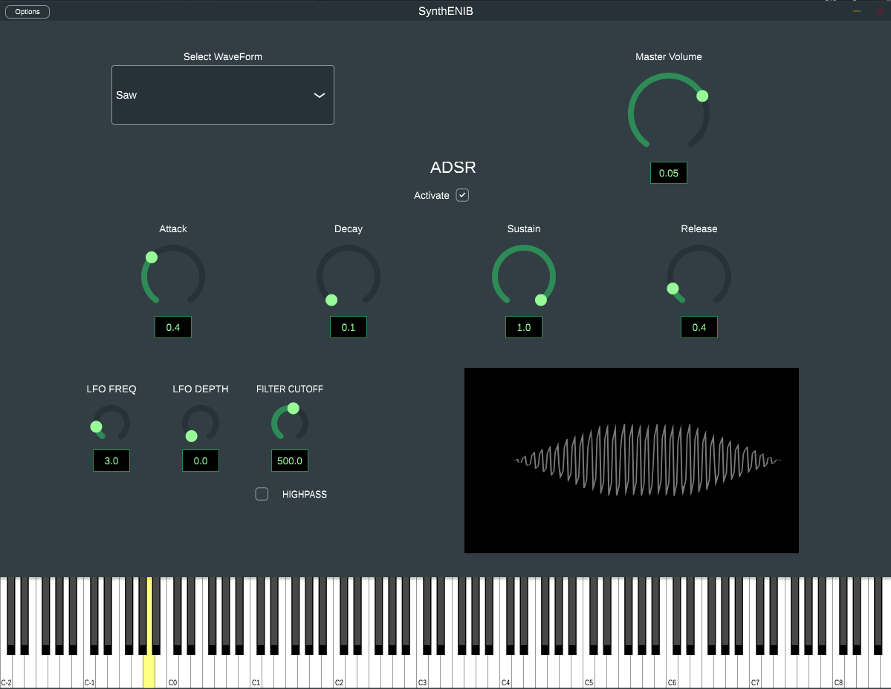

# Synth-ENIB
A simple polyphonic sustractive Synthesizer using the JUCE C++ Framework.

### Execution
You can directly run the **executable** (in the Release Section), use the **VST3** or follow these steps to build the project:

1. Cloner this git repo
1. Clone the juce library [JUCE](https://github.com/juce-framework/JUCE.git)
1. Install the necessary librarries for JUCE by running this shell script `Extras/install_libraries.sh`
1. Launch the `Projucer` (included in the JUCE Library: `JUCE/extras/Projuicer`). Copy the script `Extras/run.sh` in that folder then run it.
1. open the Projucer File of this Project (SynthENIB.jucer)
1. Right-Click on `Linux Makefile` then click on `Save this exporter` (or do `ctrl+s`)
1. If the folders `Build` & `JuceLibraryCode` has not been created, launch the Projucer again (`./Projucer`) then repeat the last step.
1. Compile this project by running `run.sh`.
   
### Extras
1. The `.vscode` folder lets you have the autocorrect on VsCode.

* Yassine SAHEB ETTABAA, 2024
